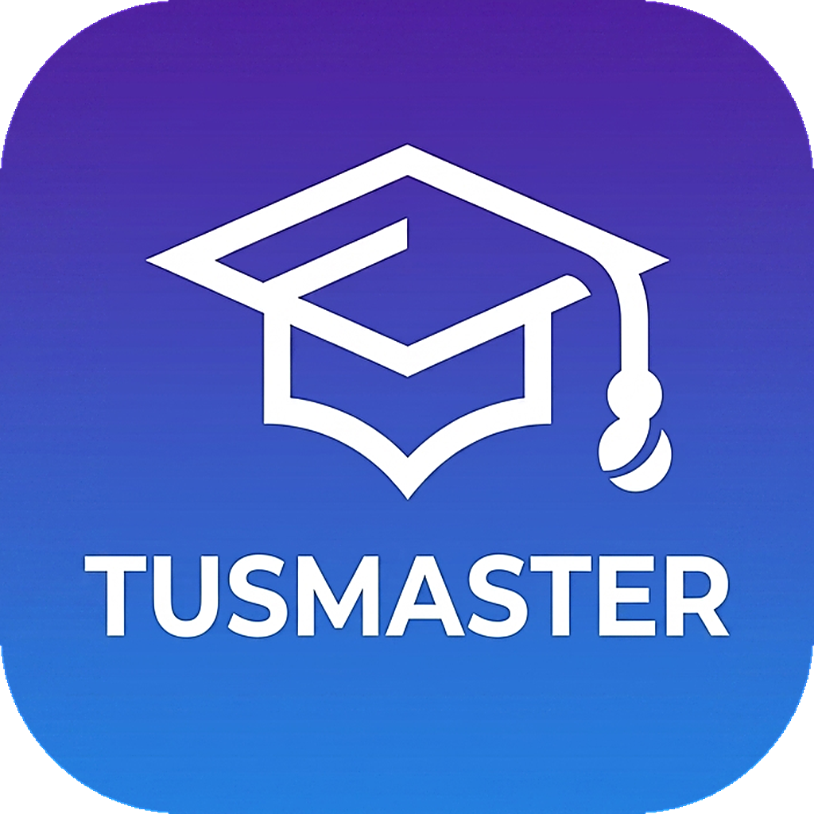

# TUS Master Pro

**TUS hazırlığı için yapay zekâ destekli masaüstü çalışma uygulaması**

2.400'ü aşkın telifsiz çalışma sorusu · 🧠 kalıcı hafıza (SRS) · 💊 ilaç kartları · 🩺 TUS simülatörü · her şıkka derin AI analizi

---

## 📥 İndir

| Platform | İndir |
|---|---|
| 🪟 **Windows** | **[⬇️ TusMaster-Windows.zip](https://github.com/TusMasterApp/TusMaster/releases/latest/download/TusMaster-Windows.zip)** |
| 🍎 **macOS** | **[⬇️ TusMaster.dmg](https://github.com/TusMasterApp/TusMaster/releases/latest/download/TusMaster.dmg)** |

> Bu linkler **her zaman en son sürümü** verir. Tüm sürümler: **[Releases sayfası](https://github.com/TusMasterApp/TusMaster/releases/latest)**

---

## ⚡ Hızlı Başlangıç

**🪟 Windows:** ZIP'i bir klasöre çıkar (sağ tık → *"Tümünü ayıkla"*) → **`TusMaster.exe`**'ye çift tıkla.
> `TusMaster.exe` ile yanındaki **`_internal`** klasörünü aynı yerde tut. *"Windows bilgisayarınızı korudu"* (SmartScreen) çıkarsa → **Ek bilgi → Yine de çalıştır** (yalnızca ilk seferde).

**🍎 Mac:** `.dmg`'ye çift tıkla → **TusMaster**'ı **Applications**'a sürükle. İlk açışta Applications'ta TusMaster'a **sağ tık → Aç → Aç** (yalnızca ilk seferde).

**🔑 İlk açılışta:** Ücretsiz [Google Gemini anahtarı](https://aistudio.google.com/apikey) al → karşılama ekranına yapıştır → başla.
> 🚫💳 **Kredi kartı GEREKMEZ.** Gemini ücretsizdir; anahtar alırken kart/ödeme isteyen bir sayfa çıkarsa **doldurma, kapat.** Sadece `AIza...` ile başlayan anahtarı kopyala.

---

## 📚 Dökümanlar

| | |
|---|---|
| 📘 **[Kullanım Kılavuzu](docs/Kullanim-Kilavuzu.md)** | Tüm özellikler, adım adım anlatım |
| ❓ **[Sıkça Sorulan Sorular (SSS)](docs/SSS.md)** | Kısa ve net cevaplar |
| 📋 **[Sürüm Notları](docs/Surum-Notlari.md)** | Bu sürümle gelen her şey |

---

## ✨ Öne çıkan özellikler

- 🧠 **Kalıcı Hafıza (SRS)** — her sorudan sonra *"ne kadar iyi hatırladın?"* dersin; uygulama o soruyu tam unutmaya yakın, bilim destekli aralıklarla tekrar karşına getirir.
- 📚 **2.400+ telifsiz çalışma sorusu** (TUS tarzı AI varyantları) — her şıkkın ayrıntılı AI analizi.
- 🩺 **TUS Simülatörü** — gerçek formatta, kronometreli tam deneme (Temel + Klinik).
- 📈 **Performans / Zayıf Analiz / Sınav Karnem** — nerede zayıfsın, gör.
- 💊 **İlaç Kartları** — endikasyon, kontrendikasyon + tek tıkla derin AI monograf.
- 🆕 **Yeni Nesil Sorular** + **Vaka Simülatörü** + **İlgili Makaleler**.
- 📄 **Kendi denemeni ekle** — PDF yükle, uygulama tarayıp soruları çıkarır.
- 🔒 **Gizlilik** — tüm verin yalnız kendi bilgisayarında kalır; otomatik günlük yedek.

---

## ⚠️ Tıbbi Sorumluluk

TUS Master Pro bir **çalışma/öğrenme aracıdır.** Yapay zekâ ara sıra hatalı veya eksik bilgi üretebilir; tüm bilgileri güncel ve güvenilir tıbbi kaynaklarla doğrula. Buradaki hiçbir içerik tıbbi tanı, tedavi veya hasta bakımı tavsiyesi değildir.

## 💌 İletişim & Geri Bildirim

Uygulama içindeki **🐞 Sorun Bildir** düğmesi · ✉️ myny061955@gmail.com
